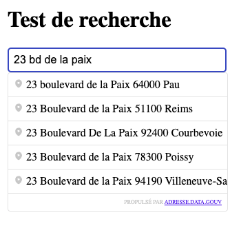

# react-autocomplete-france

`react-autocomplete-france` is a React library for address autocompletion in France. It uses the `adresse.data.gouv.fr` API to provide real-time address suggestions.

Live example : [https://tinyurl.com/example-autocomplete](https://tinyurl.com/example-autocomplete).




## Getting started

Install the library:

```shell
npm install react-autocomplete-france
```
```shell
yarn add react-autocomplete-france
```
```shell
pnpm install react-autocomplete-france
```

## Example

### Fast example
```jsx
import {useAutocomplete} from "../../hooks";

export function ExampleAutocomplete() {

    const { ref } = useAutocomplete({
      onSuggestionSelected: (suggestion) => {
        console.log(suggestion);
      },
    });

    return <input ref={ref}/>;
}
```

### Full example

```jsx
import {useAutocomplete} from "../../hooks";

export function ExampleAutocomplete() {

    const { ref } = useAutocomplete({
      onSuggestionSelected: (suggestion) => {
        console.log(suggestion);
      },
      debounce: 300,
      limit: 5,
      hasWatermark: true,
      containerStyle: {
          backgroundColor: 'white'
      },
      suggestionStyle: {
          padding: '8px',
          borderBottom: '1px solid #ccc',
          cursor: 'pointer'
      },
    });

    return (
        <div>
            <h1>Exemple</h1>
            <input ref={ref}/>
        </div>
    )
}
```

## Reference

### Props

Props for the `useAutocomplete` hook:

```typescript
onSuggestionSelected?: (suggestion: AutocompleteFeature) => void
debounce?: number
limit?: number
hasWatermark?: boolean
containerStyle?: React.CSSProperties
suggestionStyle?: React.CSSProperties
```

Table with the props:

| Prop | Type | Description |
| --- | --- | --- |
| `onSuggestionSelected` | `(suggestion: AutocompleteFeature) => void` | Callback function that is called when a suggestion is selected. |
| `debounce` | `number` | Debounce time in milliseconds. |
| `limit` | `number` | Maximum number of suggestions to show. |
| `hasWatermark` | `boolean` | Whether to show the watermark. |
| `containerStyle` | `React.CSSProperties` | Style object for the container. |
| `suggestionStyle` | `React.CSSProperties` | Style object for the suggestions. |

## Contributing

You can contribute to this project by opening an issue or a pull request.

## License

This project is licensed under the MIT License.
